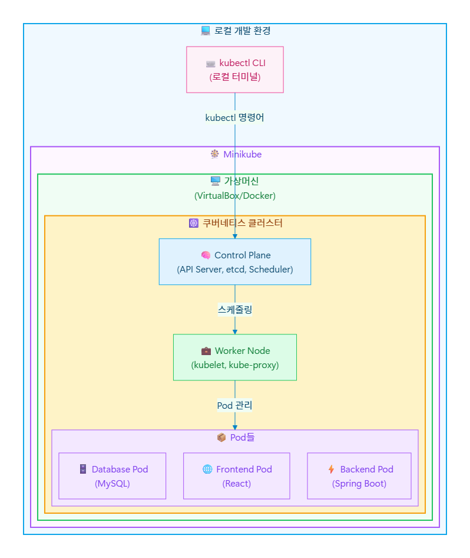

# Minikube 클러스터 실습

## 이론

<div style="display: flex; align-items: flex-start; gap: 20px;">
  

  <div>
    <h2>Minikube란?</h2>
    <p>개인 컴퓨터에 설치하는 작은 놀이공원처럼 실제 쿠버네티스의 모든 기능을 로컬에서 체험할 수 있는 학습 도구이다.</p>
    <h4>핵심 특징</h4>
    <ul>
      <li>복잡한 클라우드 설정 없이 쿠버네티스 학습가능</li>
      <li>실제 운영환경과 동일한 API와 기능 제공</li>
      <li>실수해도 안전한 샌드박스 환경</li>
      <li>AWS, GCP와 같은 클라우드 비용 없이 무료 학습</li>
      <li>몇분안에 쿠버네티스 클러스터 구축</li>
    </ul>
  </div>
</div>

--- 

### Minikube 설치
#### Mac OS
```
# Homebrew로 Minikube 설치
brew install minikube

# Docker 드라이버로 Minikube 시작 (추천)
minikube start --driver=docker

# kubectl 설치
brew install kubectl
```

#### Window
```
# Scoop으로 설치
scoop install minikube

# Docker Desktop이 설치되어 있다면
minikube start --driver=docker

# kubectl 설치
scoop install kubectl
```

--- 
### 명령어 구조
```
# kubectl 명령어 기본 구조
kubectl [동작] [리소스타입] [리소스이름] [옵션]
```

#### 조회
```
kubectl get pods              # 채널 목록 보기 (Pod 목록)
kubectl get services          # 방송국 목록 보기 (Service 목록)
kubectl get deployments      # 프로그램 목록 보기 (Deployment 목록)
```

#### 상세 
```
kubectl describe pod my-pod   # 특정 채널 상세 정보 보기
```

#### 생성/삭제
```
kubectl create deployment nginx --image=nginx    # 새 채널 추가
kubectl delete pod my-pod                        # 채널 삭제
```

#### 실시간 모니터링
```
kubectl logs my-pod           # 채널 로그 보기 (실시간 방송 내용)
kubectl exec -it my-pod bash  # 채널 내부로 접속 (백스테이지 진입)
```

## 실습

### DB

#### Minikube 적용
```
# Redis Pod 배포
kubectl apply -f k8s/redis-service.yaml
kubectl apply -f k8s/redis-pod.yaml

# 상태 확인
kubectl get pods
kubectl logs redis-pod

# Redis 연결 테스트
kubectl exec -it redis-pod -- redis-cli ping
# 예상 출력: PONG
```

### Node.js 이미지 빌드 & 배포

#### 이미지 빌드
```
# Minikube Docker 환경 설정
eval $(minikube docker-env)

# 백엔드 이미지 빌드
cd backend
docker build -t todo-backend:latest .
cd ..
```

#### Minikube 적용
```
# 백엔드 Pod 배포
kubectl apply -f k8s/backend-pod.yaml

# 상태 확인
kubectl get pods
kubectl logs backend-pod -f

# API 테스트
kubectl port-forward pod/backend-pod 3001:3001 &
curl http://localhost:3001/health
```

### 프론트 이미지 빌드 & 배포

#### 이미지 빌드
```
# 프론트엔드 이미지 빌드
cd frontend
docker build -t todo-frontend:latest .
cd ..
```

#### Minikube 적용
```
# 프론트엔드 Pod 배포
kubectl apply -f k8s/frontend-pod.yaml

# 상태 확인
kubectl get pods
```

### 전체 테스트
```
# 1. 모든 Pod 상태 확인
kubectl get pods -o wide

# 예상 출력:
# NAME           READY   STATUS    RESTARTS   AGE   IP
# redis-pod      1/1     Running   0          10m   172.17.0.3
# backend-pod    1/1     Running   0          8m    172.17.0.4
# frontend-pod   1/1     Running   0          5m    172.17.0.5

# 2. 포트 포워딩 설정
kubectl port-forward pod/backend-pod 3001:3001 &
kubectl port-forward pod/frontend-pod 8080:80 &

# 3. 애플리케이션 테스트
curl http://localhost:3001/health
curl http://localhost:8080

# 4. 브라우저에서 접속
# http://localhost:8080
```

### 정리 & 리소스 확인
```
# 생성된 리소스 확인
kubectl get all

# Pod 상세 정보
kubectl describe pods

# 리소스 정리
kubectl delete pod redis-pod backend-pod frontend-pod

# 이미지 확인
docker images | grep todo
```